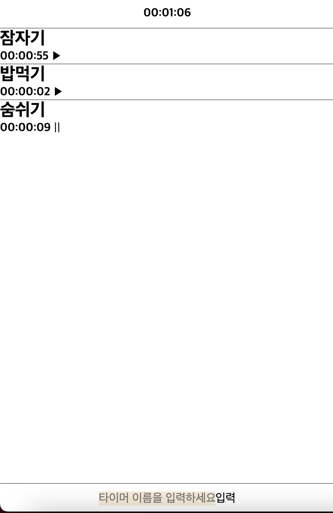

# Timer

## 간단한 소개

타입스크립트를 활용하기 위해 시작한 프로제트로, 투두리스트를 만들고 각 할 일들을 하는데 걸린 시간과 총 얼마의 시간이 걸렸는지를 측정해줍니다.

## 쓰인 기술

Typescript, CSS, HTML

## 기간

약 2주

## 구현한 것들

- form에서 할 일을 입력하면 타이머가 만들어지고, 각 타이머의 재생버튼을 누르면 시간 측정을 시작
- 시간 측정을 시작한 타이머의 일시정지 버튼을 누르면 시간 측정이 중단됨.
- 각 타이머의 시간 기록이 갱신될 때 마다, 시간의 총합도 갱신됨.

(실행 화면)

## 아쉬웠던 점

최대한 객체지향에 가깝게 프로그램을 작성하려고 했으나, 프로그램의 구조가 좀 더 깔끔했으면 좋겠다.

## 개선하고 싶은 것

- 프로그램의 구조를 좀 더 깔끔하게 개선하고 싶다.
